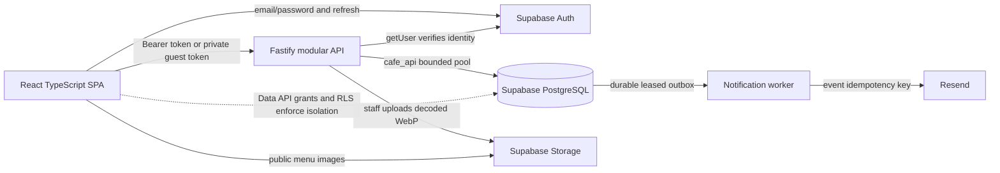
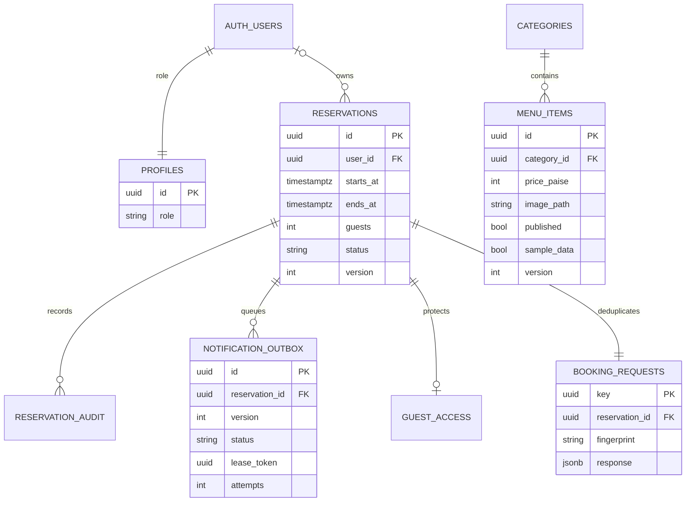

# Inspection and architecture

Inspection was performed against the actual root repository and uncommitted workspace on 8 October 2026. It was not based on the remote README's claims.

## Existing application

The root app used React 18, React Router 6 and Create React App. Frontend imports used Firebase Auth, Firestore and initialized Firebase Storage. Actual image uploads called Cloudinary through an unsigned upload preset. Reservation status emails were sent from the browser with EmailJS. There was no Node service, Firebase Functions implementation, MongoDB driver or Mongoose model in the inspected code.

Useful features were menu categories, menu CRUD/image uploads, guest booking, staff reservation lists and basic metrics. Menu data was fetched three times for overlapping views. Lists loaded all records and filtered on the client. Error handlers often swallowed failures into empty lists. Newsletter submission displayed success without persisting anything. Testimonials and popularity claims lacked verified data.

Firestore allowed anonymous reservation insertion and any authenticated user to read/change/delete reservations and modify menu content. Firebase Storage allowed broad authenticated writes. The frontend ProtectedRoute checked only whether a user was signed in. Bookings had no server validation, overlap/capacity model, idempotency, transaction audit or stale-update protection. Status changes and email delivery were independent, so notification failure produced a misleading booking failure.

The original package manifest did not list Firebase even though the source imported it. The Home image path pointed at a missing PNG while an untracked JPG existed. There was a nested tracked Git checkout without a usable `.gitmodules` entry; it had its own edits. The root also had uncommitted Home/Menu CSS, Home JS, lockfile and Firebase hosting-cache changes.

## Decisions

Keep React, route structure and cafe wordmark/interior asset. Move active new code to TypeScript under `src/app`; preserve old UI/source changes as migration references. Replace CRA's build tooling with Vite. Use Fastify because this SPA had no suitable server routes. Keep separate modules for auth, menu, reservations, administration and notifications inside one deployable application.

Supabase supplies PostgreSQL, Auth and image Storage. Direct PostgreSQL connections use a restricted `cafe_api` role through a bounded pool. Browser SDK access handles Auth only; private operations use the API. The database functions that mutate reservations live in an unexposed schema and are not callable by client Data API roles.

The worker is a second process from the same codebase. Its purpose is durable asynchronous email delivery; its operational cost is one process, two database connections, health supervision and queue monitoring. Resend is an external email provider with an ongoing account/domain/API dependency; its keys are optional until email delivery is needed. No Redis, message broker, microservice mesh or payment service is required.

## Runtime diagram

## Entity relationships

The reservation-to-booking-request relationship describes newly created API bookings; imported historical reservations can have no request key. Settings, rate budgets, guest hashes, import checksums, request records and outbox payloads live in `cafe_private`. Only intended public tables are exposed to PostgREST, all with RLS and explicit grants. Auth deletion removes the profile and detaches reservation ownership; it preserves operational/audit records. Menu category deletion is restricted while referenced. Audit/outbox/request references prohibit casual reservation deletion.

## Official integration references

The implementation follows [Supabase Auth server user verification](https://supabase.com/docs/reference/javascript/auth-getuser), [Supabase RLS and explicit grants](https://supabase.com/docs/guides/database/postgres/row-level-security), [Storage access control](https://supabase.com/docs/guides/storage/security/access-control), [PostgreSQL locking](https://www.postgresql.org/docs/current/explicit-locking.html) and [Fastify validation](https://fastify.dev/docs/latest/Reference/Validation-and-Serialization/). Zod validates application input before SQL; database constraints and functions enforce invariants again. Consult the linked official docs when upgrading pinned dependencies.
