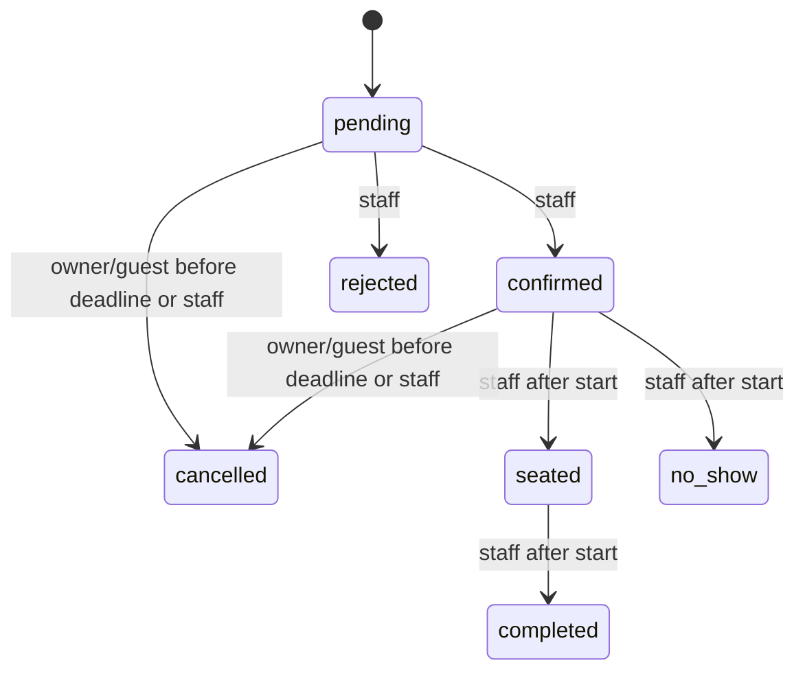

# Reservation system design

## Business model and correctness

This is one cafe with seat-based capacity, not a floor-plan/table assignment system. Capacity 24, maximum party 10, a 90-minute visit, 30-minute starts, 09:00–22:00 daily hours, two-hour booking/cancellation notice, Asia/Kolkata timezone and a 60-day horizon are **development defaults**, not verified business policy. An operator must confirm them before cutover. Settings are validated in PostgreSQL. Hours span one local calendar day; closed days are null. Overnight schedules and multiple venues are not implemented.

Pending, confirmed and seated reservations consume capacity. Completed, cancelled, rejected and no-show records do not. Intervals are half-open `[start,end)`, so a visit ending at 13:30 does not overlap one beginning at 13:30. There are no temporary holds or expiry jobs. Pending bookings remain reserved until staff act; unattended pending records are an operational limit.

`peak_seats` finds the peak occupancy during a candidate interval. It evaluates the candidate start and each existing intersecting reservation's start, summing guests whose intervals contain that point. This handles unequal/overlapping intervals without incorrectly adding two back-to-back parties that never coexist.

`create_booking` locks the singleton settings row with `FOR UPDATE`, looks up idempotency, checks identity and booking rules, consumes durable abuse budgets only for a new booking, and inserts the reservation. A capacity trigger acquires the same lock and checks peak occupancy. Every API instance reaches the same lock. PostgreSQL's default READ COMMITTED isolation gives later statements in the volatile function a current snapshot after the previous booking commits. No frontend check or in-process mutex authorizes allocation. A trigger also protects direct privileged inserts from excess capacity, though database owners remain inherently trusted.

The reservation audit and outbox inserts are AFTER triggers within the same transaction. If any invariant fails, all writes roll back. Cancellation takes the settings lock before the reservation row lock, validates permissions/version/transition and releases capacity by changing the state. Lock ordering is consistent inside the application. Privileged bulk maintenance should stop booking writes and follow that ordering.

## Booking sequence

```mermaid
sequenceDiagram
  participant C as Customer
  participant A as Fastify API
  participant P as PostgreSQL
  participant W as Worker
  participant E as Email provider
  C->>A: GET availability(date, guests)
  A->>P: Read current peak for valid slots
  A-->>C: Advisory availability
  C->>A: POST booking + UUID idempotency key
  A->>A: Validate body and optional verified identity
  A->>P: create_booking(actor, fingerprint, guest hash, budgets)
  P->>P: Lock settings row; check saved request
  alt Existing matching request
    P-->>A: Immutable creation response, replay=true
  else New request
    P->>P: Validate rules; check capacity trigger
    P->>P: Insert reservation + audit + outbox + request
    P-->>A: Commit creation response
  end
  A-->>C: 201 new or 200 replay; guest token if needed
  W->>P: Claim due event with lease and token
  W->>E: POST email with stable event key
  E-->>W: Provider receipt
  W->>P: Acknowledge if lease token still matches
```

## Idempotency and retries

The client generates a UUID per submitted payload and keeps the last request in tab session storage, scoped to the signed-in user or guest. A network retry with unchanged details reuses the key. Server validation normalizes names, emails, notes and UTC timestamps; the SHA-256 fingerprint covers the canonical body. A globally unique request key is associated with that fingerprint and actor. Reusing it with different normalized details or another actor returns `IDEMPOTENCY_MISMATCH`.

The original booking response is stored in the transaction. Concurrent duplicates serialize under the same lock, so only one inserts. Later replay returns the immutable creation result, which may be older than the reservation's current status; GET retrieves current state. Failed bookings do not retain a successful result. Creation keys are retained indefinitely for this small cafe; any future retention policy must also define a retry horizon and archival lookup so old retries cannot create a second booking.

Guest access tokens are HMACs of the random key and fingerprint using a stable server secret. Only their SHA-256 hashes are stored privately. The same request produces the same token on replay; guessing the public reservation UUID is insufficient. Tokens travel in `X-Booking-Token`, never query strings. The copied link uses a fragment. Guests must keep their private link; old imported guest records have no such token. Account bookings are never claimed by matching an email. A valid guest token continues to work after signing in.

## State and stale edits



Terminal states cannot reopen. Rescheduling is not supported; cancel and create a new booking. Staff submit the version they read. A lock plus equality check rejects stale updates with `STALE_VERSION`; accepted changes increment the version and append the audit actor, time, old/new status and resulting version. Customer/guest cancellation is allowed only from pending/confirmed before the configured deadline. Staff may cancel after the deadline. Arrival/no-show/completion cannot precede the start. Menu edits also use version-checked updates.

## Permissions and sessions

The API verifies each bearer token with `supabase.auth.getUser(token)` and loads its role from the database. User-controlled metadata is ignored. The browser's session read is only for attaching a token or displaying account state; it is never server authority. Browser tokens are stored in tab session storage and refreshed by the SDK. XSS can still access SPA tokens; HTTPS, restricted script sources, no untrusted HTML and dependency maintenance remain necessary. Logout revokes/signs out through Supabase; high assurance staff deployments should enable MFA and shorter configured sessions.

Customers receive SELECT grants and owner-only RLS for their profile, reservations and audit. Public SELECT is limited to published menu items and associated categories. Client roles have no booking/profile/menu write grants. Private schema functions have no PUBLIC, anon, authenticated or service-role EXECUTE grant. Service-role booking DML is revoked too. The runtime role can read staff data and edit menu content, so its API handlers explicitly authorize every such operation. Runtime role cannot directly write reservations or profiles; only narrowly granted database functions can do that. Database-owner credentials exist only in operator scripts and must not be supplied to the API.

Storage allows public reads from the menu-images bucket. Customers and staff JWTs cannot upload directly; the API checks staff, bounds request size/pixel count, decodes allowed static formats, strips metadata by re-encoding to WebP, uses a unique path and then invokes server Storage credentials. SVG/HTML/arbitrary remote URLs are not accepted. New paths make immutable image caching safe. Unreferenced uploads need periodic operator cleanup after verifying no menu references.

## Notifications

Booking/state changes enqueue immutable recipient/status snapshots with uniqueness on `(reservation_id,version)`. A worker claims one due event through `FOR UPDATE SKIP LOCKED`, increases attempts and sets a 60-second lease plus a random fencing token. A crash leaves durable work; expired leases can be reclaimed. Acknowledgement/failure updates require the matching token, preventing an old worker from overwriting a newer claim.

The provider call has a 15-second timeout and a stable `piccolo/<event UUID>` idempotency header. Retries use exponential backoff, cap at eight attempts, and stop after 23 hours from the first attempt. [Resend's idempotency window is 24 hours](https://resend.com/docs/dashboard/emails/idempotency-keys); the implementation does not promise exactly-once delivery forever. Provider acceptance followed by a worker crash can be retried with that key inside the window. Later ambiguous jobs become dead rather than being blindly resent. Delivery order is not guaranteed across workers; customers should treat the booking page as current state. Recipient/status changes create distinct events.

Without a configured provider the worker exits before claiming. The dashboard shows queue/failure counts and event states; API success does not claim an email was delivered. Manual intervention after dead events requires checking provider records for the event ID before sending anything again. The worker sends plain text and stores safe error codes, not provider response bodies or customer details in logs.

## Performance, operations and scaling

The GiST active-range index supports intersecting reservation scans; indexes on staff time ordering, status/time and customer/time match listing patterns. Audit is indexed by reservation/id. Public menu filtering uses a category/name partial index. Rate-limit records use a hash primary key and a durable fixed-window counter; worker cleanup removes old budgets. Current name/email substring searches are bounded and paginated but do not yet use trigram indexes; add them only after measured query plans justify them.

Connections are bounded per API process (default five, maximum twenty) and per worker (two). API instances are stateless; durable request keys, capacity and limits live in PostgreSQL. Requests have body/time limits, correlation IDs, structured logs and safe errors. CORS is limited to the configured frontend origin; bearer tokens avoid cookie-based CSRF. Forwarded IP headers are trusted only from configured proxy addresses. General budgets apply to all requests, and successful new bookings consume IP/email budgets transactionally. Distributed attacks still need an edge WAF/CAPTCHA challenge if observed; local limits alone are not comprehensive abuse protection.

Availability is deliberately uncached and advisory. Menu results are also uncached initially; adding a cache requires version-based invalidation on every publish/edit and must not authorize a booking. Static WebP assets and immutable storage object paths can be cached without introducing an application service.

One cafe-wide lock intentionally trades throughput for simple correctness. Peak checking grows with intersecting reservations, and settings capacity changes scan active visits. A short local test is recorded in verification; there is no demonstrated production traffic ceiling. If lock wait becomes material, split by venue/day with a proven cross-midnight locking scheme, or build atomic slot inventory with clear discretization rules. Add bounded transaction retry for deadlocks/serialization failures, better search indexes, archive old pending records under explicit policy, and load-test sustained production-like workloads including Auth, network, notification backlog and database size before changing topology. Keep connection totals below the Supabase project's budget; use Supavisor transaction pooling with short queries and compatible role credentials when appropriate.
